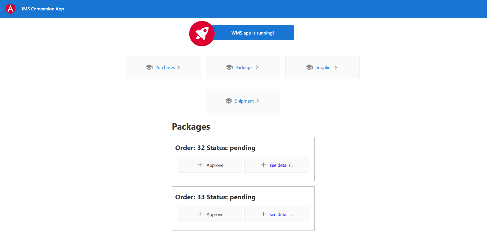
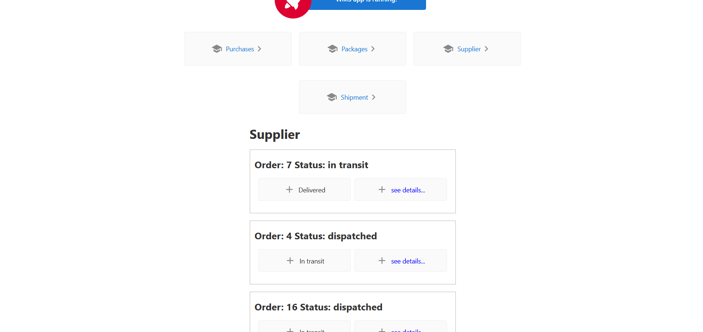
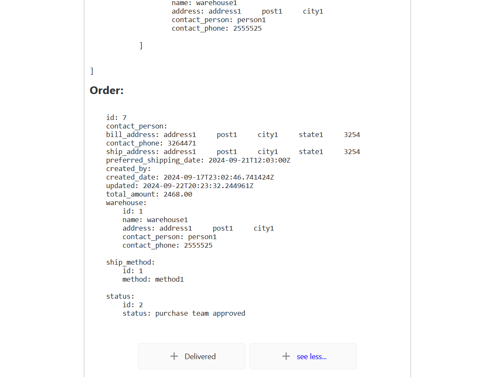

## About the Project
WMS is a companion app for <a href="https://github.com/Github19982018/IMS">Inventory Management System(IMS)</a>. WMS provides an easy interface for interacting with IMS by Warehouse employees and suppliers/vendors. Through WMS one can see and update orders send from IMS. WMS comes with a frontend using angular and <a href="https://github.com/Github19982018/WMS">backend</a> which built on django and mongodb.

<figure>

</figure>
<figure>

</figure>
<figure>

</figure>
